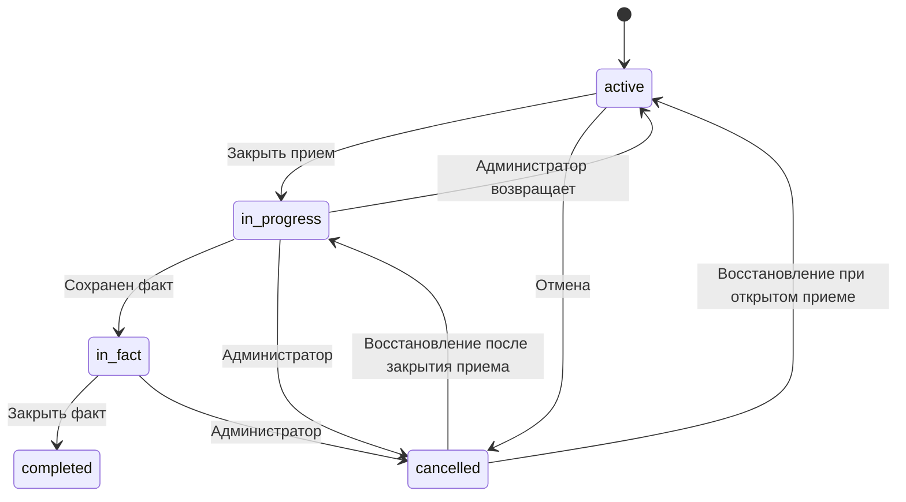

# Процессы сотрудника и администратора

Документ описывает Web-only процесс оформления работы в выходной день. Согласование выполняется вне системы. В системе хранятся зарегистрированные пользователи, заявки, фактически отработанное время, статусы, недельные блокировки и Excel-отчеты.

## Роли

| Роль | Возможности |
| --- | --- |
| Сотрудник | Регистрируется и входит по ФИО/токену, создает и корректирует доступные заявки, отменяет заявку до закрытия приема, указывает факт по принятой заявке. |
| Администратор | Управляет пользователями, заявками и статусами, создает заявки задним числом, закрывает недели, снимает блокировку приема, формирует отчеты и перевыпускает токены. |
| Суперпользователь | Назначает администраторов и выполняет административные операции; логин и пароль задаются релизной конфигурацией. |

Телефон, должность и числовой грейд не собираются. Используется только признак `Грейд 12+` в профиле пользователя. Корпоративное SSO/API остается направлением развития.

## Регистрация и вход

1. Новый пользователь указывает ФИО в формате `Фамилия Имя Отчество` и признак `Грейд 12+`.
2. Для новой регистрации обязательны ровно три кириллические части; буква `Ё` и дефис внутри части разрешены.
3. Система показывает персональный токен один раз.
4. При повторном входе пользователь вводит ФИО и токен.
5. Если токен потерян, пользователь отправляет запрос и обращается к администратору за новым токеном.
6. Заблокированный или архивированный пользователь войти не может.

Проверка личности через SSO или корпоративный мессенджер в текущую версию не входит.

## Создание заявки

Обязательные поля:

- плановая дата;
- начало и окончание;
- условия выхода;
- задача;
- обоснование;
- минимум одна АС.

Для `Грейд 12+` доступен только `Отгул`. Для остальных по умолчанию выбрана `Двойная оплата`, также доступен `Отгул`.

Сотрудник не может создать заявку на прошедшую дату. Для поздней заявки он обращается к администратору. Администратор может создать заявку задним числом.

### Ночной интервал

Если окончание раньше начала, форма заранее показывает информационный блок:

> Будет создано две заявки
> Первая дата: начало–00:00
> Следующая дата: 00:00–окончание

Дополнительных кнопок подтверждения нет. После нажатия обычной кнопки сохранения система одной транзакцией создает две заявки:

- каждая получает собственные `response_id` и `request_uid`;
- обе получают общий `request_group_id`;
- задача, обоснование, условия выхода и АС копируются;
- блокировки и дубли проверяются для обеих дат до вставки;
- при ошибке не создается ни одна часть.

Корректировка существующей одиночной заявки в ночной интервал не выполняется. Для этого создается новая ночная заявка, после чего прежняя заявка отменяется при доступности такого действия.

### Предупреждение об обеде

Правило применяется к каждой заявке отдельно, в том числе после ночного разделения:

| Длительность | Поведение |
| --- | --- |
| До 4 ч 59 мин включительно | Предупреждения нет |
| От 5 ч 00 мин включительно | `Из рабочего времени будет вычтен 1 час на обед` |

Предупреждение информационное. Система не изменяет интервал, не вычитает час и не рассчитывает отдельное время к учету.

## Статусы заявки

| Код | UI | Назначение |
| --- | --- | --- |
| `active` | Заявка подана | План доступен сотруднику, если неделя не закрыта. |
| `in_progress` | Принята в работу | План зафиксирован, сотрудник может указать факт. |
| `in_fact` | Факт указан | Факт сохранен, но период факта еще не закрыт. |
| `completed` | Закрыта | Факт закрыт администратором. |
| `cancelled` | Отменена | Заявка отменена; факт не обязателен. |

Отметка `заявка откорректирована` является признаком, а не отдельным статусом.

### Разрешенные переходы

`in_fact` и `completed` невозможны без фактического времени. Администратор видит только допустимые переходы. Сотрудник не восстанавливает отмененную заявку самостоятельно.

## Недельные блокировки

Администратор выбирает любую дату, а система рассчитывает полную неделю с понедельника по воскресенье.

### Закрыть прием заявок

- показывает неделю и количество затрагиваемых заявок;
- требует подтверждения;
- запрещает пересекающуюся блокировку того же типа;
- переводит `active` в `in_progress`;
- блокирует создание, корректировку и отмену сотрудником.

Снятие блокировки приема удаляет только блокировку. Статусы не откатываются.

### Закрыть ввод факта

- переводит `in_fact` в `completed` по фактическим датам недели;
- блокирует ввод и изменение факта сотрудником;
- не влияет на плановую часть.

Формирование Excel само по себе не закрывает неделю.

## Ввод факта

1. Факт доступен сотруднику только для `in_progress` и `in_fact`.
2. Дата факта не вводится: используется эффективная плановая дата конкретной заявки.
3. Пользователь вводит начало и окончание фактически отработанного времени.
4. Факт связывается с `request_uid`, а не только с ФИО и датой.
5. Фактический интервал через полночь вводится отдельно по двум заявкам.
6. После сохранения заявка переходит в `in_fact`.
7. Правило предупреждения от пяти часов применяется к фактическому интервалу без автоматического вычета.

## Отчеты

Администратор выбирает любую дату недели; интерфейс передает период с понедельника по воскресенье. На каждом листе указываются выбранный период и дата подготовки.

- Отчет 1: полный план для руководства, АС, количество фактических дней за месяц и комментарий.
- Отчет 2: краткий план для заведения заявок и комментарий.
- Отчет 3: отдельный факт каждой Web-заявки; записи одного сотрудника за одну дату не объединяются. Старый Excel-факт используется только при отсутствии Web-факта сотрудника за эту дату.
- Отчет 4: план и факт сопоставляются по конкретной заявке. Отмененные заявки остаются для аудита, а факт отмечается как `Не требуется`.

Отчеты 1–2 включают `active`, `in_progress`, `in_fact`, `completed` и исключают `cancelled`. CSV сотрудников и проверка телефона не используются. Признак `Грейд 12+` читается из профиля пользователя в SQLite.

## Corner cases

| Ситуация | Решение |
| --- | --- |
| Два выхода в один день | Две заявки с разными интервалами и отдельными фактами. |
| Работа в субботу и воскресенье | По одной заявке на каждую дату. |
| Один интервал пересекает полночь | Одна форма автоматически создает две связанные заявки. |
| Одна из ночных частей длится 5 часов | Предупреждение показывается только для этой части. |
| Форма отправлена дважды | Транзакционная проверка дубля не создает повторную заявку. |
| Нужна правка после закрытия приема | Сотрудник обращается к администратору; администратор исправляет или возвращает заявку. |
| Нужно восстановить отмененную заявку | Только администратор; целевой статус зависит от блокировки приема. |
| У отмененной заявки нет факта | В Отчете 4 указывается `Не требуется`. |
