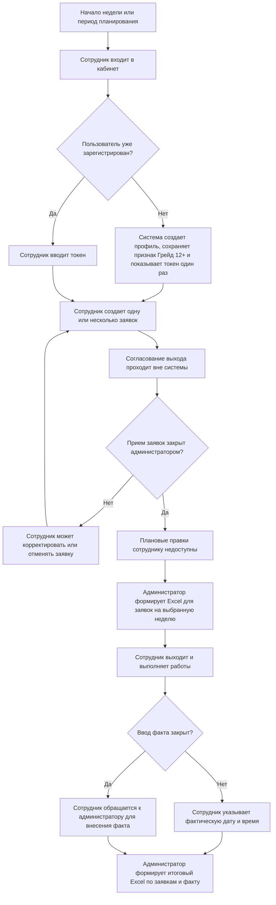
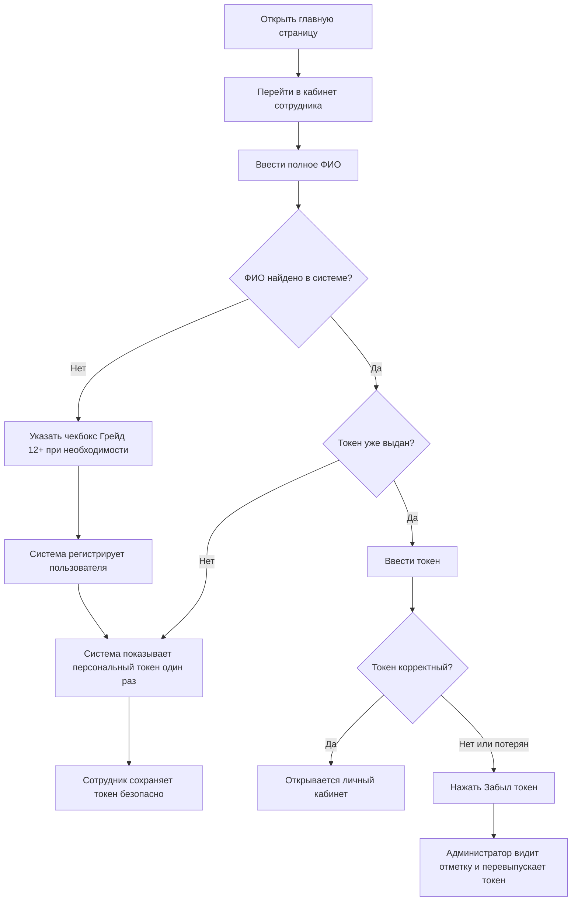
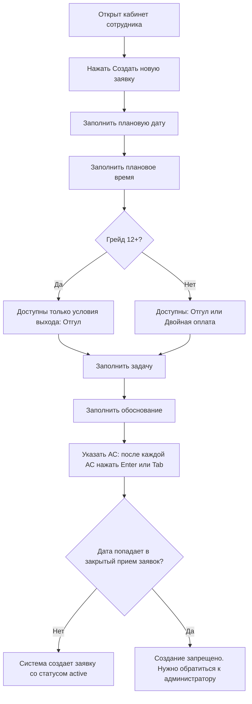
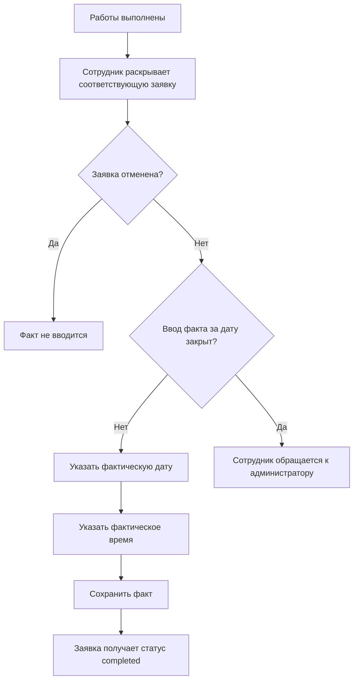
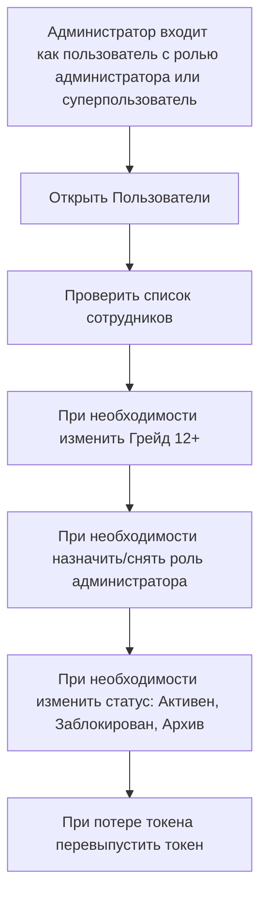
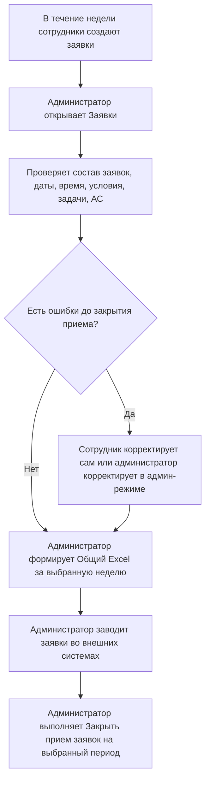
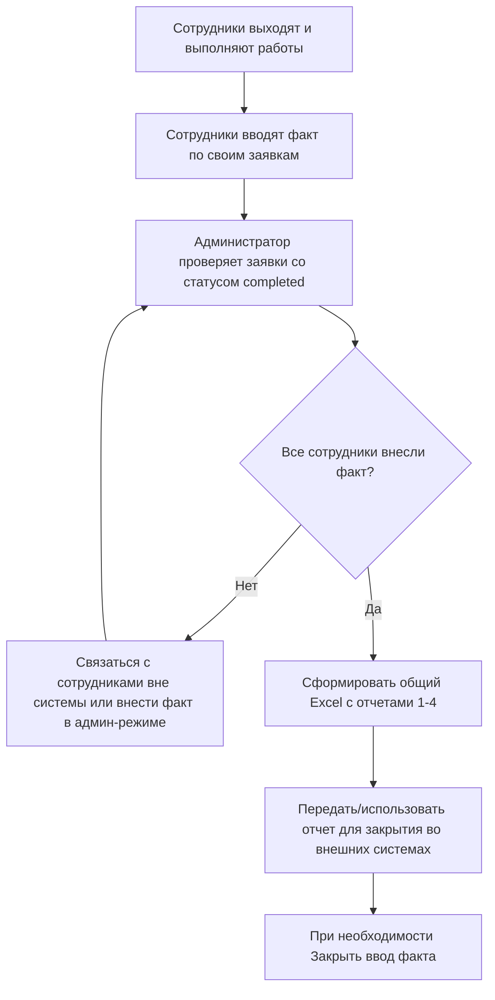

# Процессы сотрудника и администратора

Документ описывает рабочие сценарии Web UI для оформления выхода в выходной день, фиксации факта и административного закрытия периодов. Процесс согласования выхода выполняется вне системы; Web UI фиксирует заявки, фактически отработанное время, блокировки и отчеты.

## Роли

| Роль | Что делает в системе | Что делает вне системы |
| --- | --- | --- |
| Сотрудник | Регистрируется/входит, создает заявки, корректирует их до закрытия приема, отменяет заявки до закрытия приема, указывает факт после выполнения работ. | Согласует выход по принятому в организации процессу. Если период закрыт и нужна правка, связывается с администратором. |
| Администратор | Управляет пользователями, формирует отчеты, закрывает прием заявок, закрывает ввод факта, корректирует заявки после блокировок, перевыпускает токены. | Заводит заявки во внешних системах, получает обращения от сотрудников по правкам после закрытия. |
| Суперпользователь | Входит по логину/паролю релизной конфигурации, назначает администраторов и выполняет админские операции. | Используется для первичной настройки и аварийного доступа. |

## Статусы и блокировки

### Статусы заявки

| Статус | Значение | Кто может перевести |
| --- | --- | --- |
| `active` | Заявка создана и актуальна. | Система при создании заявки. |
| `cancelled` | Заявка отменена. | Сотрудник до закрытия приема заявок; администратор всегда в админ-режиме. |
| `completed` | Фактически отработанное время указано. | Сотрудник до закрытия факта; администратор всегда в админ-режиме. |

Отметка `заявка откорректирована` не является отдельным статусом. Она ставится, когда меняются плановые поля заявки: дата, время, условия выхода, задача, обоснование или АС.

### Блокировки периода

| Блокировка | Что запрещает сотруднику | Что не запрещает | Что может администратор |
| --- | --- | --- | --- |
| `Закрыть прием заявок` (`planning`) | Создание, отмену и корректировку плановой части заявки за выбранный период. | Ввод факта по уже созданной заявке, если факт не закрыт отдельной блокировкой. | Создавать, отменять и корректировать заявки в админ-режиме; снять блокировку приема без изменения статусов заявок. |
| `Закрыть ввод факта` (`actual`) | Ввод и изменение фактически отработанного времени за выбранный период. | Плановые операции, если прием заявок не закрыт. | Вносить/исправлять факт в админ-режиме. |
| Закрытие отчетом (`app_report_lock`) | Правки по заявкам, попавшим в сформированный отчет. | Административные исправления. | Корректировать в админ-режиме при необходимости. |

## Общая схема процесса



## Workflow сотрудника

### 1. Первый вход или повторный вход



Правила:

- ФИО вводится полностью без сокращений.
- Токен показывается один раз. После этого сотрудник входит по ФИО и токену.
- Если токен потерян, сотрудник нажимает `Забыл токен`; администратор перевыпускает токен и передает его сотруднику безопасным способом.
- Если пользователь заблокирован или архивирован, вход недоступен до изменения статуса администратором.

### 2. Создание заявки



Правила:

- На каждый независимый временной слот создается отдельная заявка.
- Если сотрудник работает в субботу и воскресенье, создаются две заявки, по одной на каждую дату.
- Если в один день есть два разных временных окна, создаются две заявки на одну дату с разным временем.
- Для сотрудников с признаком `Грейд 12+` значение `Двойная оплата` недоступно.

### 3. Корректировка или отмена заявки

```mermaid
flowchart TD
    A["Сотрудник раскрывает заявку"] --> B{"Прием заявок по плановой дате закрыт?"}
    B -- "Нет" --> C["Можно изменить плановую дату, время, условия, задачу, обоснование, АС"]
    C --> D["Сохранить корректировку"]
    D --> E["Система ставит отметку заявка откорректирована"]
    B -- "Нет, заявка больше не нужна" --> F["Нажать Перевести в статус Отменена"]
    F --> G["Заявка получает статус cancelled"]
    B -- "Да" --> H["Форма корректировки недоступна"]
    H --> I["Если правка нужна, сотрудник пишет администратору по почте/корпоративному каналу"]
    I --> J["Администратор вносит правку в админ-режиме"]
```



Правила:

- После `Закрыть прием заявок` сотрудник не может корректировать или отменять заявку.
- Если после закрытия приема обнаружена ошибка в заявке, сотрудник обращается к администратору. В системе это не автоматизированное согласование.
- Администратор может изменить заявку в админ-режиме и при необходимости заново сформировать отчет.

### 4. Ввод фактически отработанного времени



Правила:

- Закрытие приема заявок не запрещает ввод факта.
- Ввод факта запрещает только `Закрыть ввод факта` или закрытие заявки отчетом.
- Если работа шла через границу суток, используется нормализованная фактическая дата и время по правилам отчета.

## Workflow администратора

### 1. Подготовка пользователей



Правила:

- `Заблокирован` и `Архив` делают вход сотрудника недоступным.
- При архивировании активные незакрытые заявки могут быть отменены системой, если они не находятся в закрытом периоде.
- Токен передается сотруднику вне системы безопасным способом.

### 2. Еженедельная подготовка заявок



Правила:

- Отчет формируется за выбранную неделю/период.
- `Закрыть прием заявок` фиксирует плановую часть для сотрудников.
- Существующие заявки не удаляются и не меняют статус автоматически.
- Если блокировка приема была поставлена ошибочно, администратор может снять ее кнопкой `Снять прием`; статусы заявок при этом не откатываются и не меняются.
- Если после закрытия приема сотруднику нужна правка, он обращается к администратору. Администратор правит в админ-режиме.

### 3. После выполнения работ



Правила:

- `Закрыть ввод факта` применяется после того, как факт собран и проверен.
- После закрытия факта сотрудник не может изменить фактическую дату или время.
- Администратор может внести исправление в админ-режиме, если есть обоснованная необходимость.

## Corner cases

### Несколько заявок одного сотрудника

| Ситуация | Как оформлять |
| --- | --- |
| Сотрудник работает в субботу и воскресенье | Две заявки: одна на субботу, одна на воскресенье. |
| Сотрудник работает в один день в двух разных окнах | Две заявки на одну дату с разным временем. |
| Сотрудник меняет время до закрытия приема | Сотрудник раскрывает заявку и сохраняет корректировку. |
| Сотрудник меняет время после закрытия приема | Сотрудник обращается к администратору; администратор правит в админ-режиме. |

### Закрытый прием заявок

| Ситуация | Поведение системы |
| --- | --- |
| Создание новой заявки сотрудником на закрытую дату | Запрещено. |
| Корректировка заявки сотрудником, если текущая плановая дата закрыта | Запрещено, форма корректировки не показывается. |
| Перенос закрытой заявки сотрудником на открытую дату через прямой POST | Запрещено backend-проверкой. |
| Отмена заявки сотрудником на закрытую дату | Запрещено. |
| Ввод факта сотрудником по закрытому приему заявок | Разрешен, если не закрыт ввод факта. |
| Админская корректировка закрытой заявки | Разрешена в админ-режиме. |
| Администратор снимает блокировку приема | Удаляется только запись блокировки `planning`; статусы `active`, `cancelled`, `completed` и отметки корректировок не меняются. |

### Закрытый ввод факта

| Ситуация | Поведение системы |
| --- | --- |
| Сотрудник пытается ввести факт после закрытия факта | Запрещено. |
| Сотрудник ошибся в факте после закрытия факта | Обращается к администратору. |
| Администратор правит факт после закрытия факта | Разрешено в админ-режиме. |

### Пользователи и токены

| Ситуация | Поведение системы |
| --- | --- |
| Новый сотрудник входит впервые | Система создает профиль и показывает токен один раз. |
| Сотрудник потерял токен | Нажимает `Забыл токен`; администратор перевыпускает токен. |
| Токен ввели неверно | Вход не выполняется. |
| Пользователь заблокирован или архивирован | Вход запрещен. |
| Изменился признак `Грейд 12+` | Администратор меняет признак в пользователях. В новых/корректируемых заявках меняется доступность `Двойная оплата`. |

### Отчеты

| Ситуация | Поведение системы |
| --- | --- |
| Отчет сформирован до ввода факта | Плановые листы содержат заявки, фактические данные могут быть пустыми. |
| Факт внесен после отчета | Нужно сформировать отчет повторно, если руководству нужен актуальный файл. |
| Заявка отменена | В отчетах учитывается согласно текущей логике статуса; администратор должен проверять статус перед внешним закрытием. |
| Нет заявок за выбранную неделю | Отчет может быть пустым по соответствующим листам. |

## Коммуникация после блокировки

Если сотруднику нужна правка после административной блокировки:

1. Сотрудник не меняет данные в системе самостоятельно.
2. Сотрудник направляет администратору письмо или сообщение в корпоративном канале.
3. В обращении указывает ФИО, дату заявки, плановое время, что нужно изменить и причину изменения.
4. Администратор проверяет, допустима ли правка после закрытия периода.
5. Администратор вносит изменение в админ-режиме или отказывает с пояснением.
6. Если правка влияет на уже сформированный отчет, администратор формирует новый Excel и использует актуальную версию.

Рекомендуемый шаблон обращения:

```text
Тема: Правка заявки на выход в выходной после закрытия периода

ФИО:
Дата заявки:
Текущее плановое время:
Что нужно изменить:
Причина изменения:
Нужно ли менять фактически отработанное время:
```

## Открытые вопросы

Эти правила стоит уточнить перед промышленным использованием:

1. Нужен ли отдельный фиксированный e-mail администратора для обращений после блокировки или достаточно корпоративного канала?
2. Нужно ли хранить историю админских правок после закрытия периода отдельным audit log?
3. Должен ли отчет исключать `cancelled` заявки или показывать их отдельной отметкой?
4. Нужно ли автоматически закрывать прием заявок сразу после формирования Excel или администратор должен закрывать период отдельной кнопкой?
